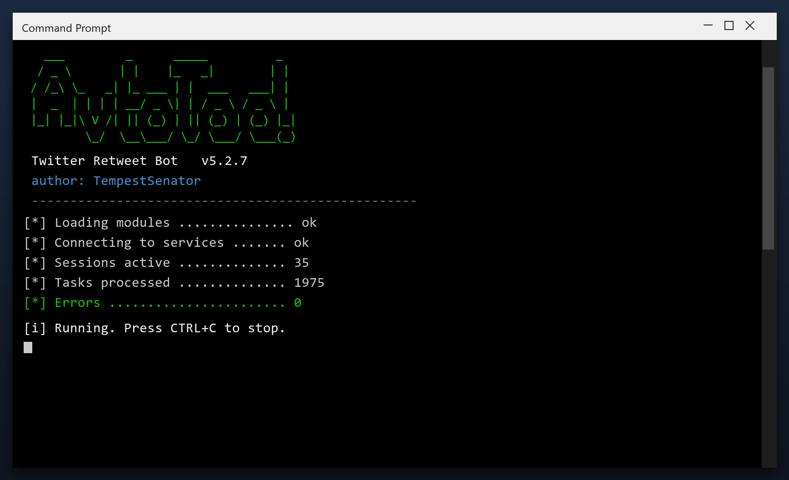

# Twitter Retweet Bot — Free 2026 Download

   

  

Twitter retweet bot free download — current 2026 version, full requirements and a step-by-step install guide, all on one page. **Completely free. No limits.**

## 📑 Contents

1. [Overview](#overview)
2. [Features](#features)
3. [Requirements](#requirements)
4. [Install](#install)
5. [FAQ](#faq)

## 🎯 At a Glance

| | |
| --- | --- |
| **Program** | Twitter Retweet Bot |
| **Version** | Latest 2026 build |
| **Price** | Free |
| **Systems** | see requirements below |
| **Download** | Quick Start section below |

## ❓ What Is Twitter Retweet Bot?

In short: twitter retweet bot does its job quickly and without complications — simple enough for beginners, with enough options for advanced users.

| **Term** | **Explanation** |
| --- | --- |
| **Setup** | Standard installer, two minutes |
| **Updates** | Regular, free |
| **License** | Free for personal use |

## ❌ The Problem

- **Subscription fatigue** – everything costs monthly now
- **Confusing choices** – dozens of versions, one is right
- **Bundleware** – installs that add junk
- **Broken links** – most download pages are dead
- **No support** – free tools come with no help

## ✅ The Solution

| **Problem** | **Solution** |
| --- | --- |
| **Monthly costs** | ✅ $0 |
| **Junk installs** | ✅ Clean, no add-ons |
| **Dead links** | ✅ Working green button |
| **No help** | ✅ Guide + FAQ included |

## 🎯 Key Features

| **Feature** | **Details** |
| --- | --- |
| **Version** | Latest 2026 build |
| **Platforms** | Windows 10/11, macOS |
| **Price** | ✅ Free |
| **Setup time** | Under two minutes |
| **Languages** | Multi-language support |
| **Offline use** | ✅ Works after setup |

## 📊 Why Twitter Retweet Bot

| **Feature** | **Paid tools** | **twitter retweet bot** |
| --- | --- | --- |
| **Cost** | $20–$100 | ✅ $0 |
| **Trial** | Limited | ✅ Full version |
| **Junk** | Often bundled | ✅ Clean install |

## 📋 System Requirements

| **Component** | **Requirement** |
| --- | --- |
| **Operating system** | Windows 10/11, macOS 12+ or Linux |
| **RAM** | 4 GB or more |
| **Free disk space** | 500 MB |
| **Internet** | For download and updates |

## 📦 What's Included

| **Component** | **Details** |
| --- | --- |
| **Program** | Latest 2026 build |
| **Guide** | Install steps |
| **Tips** | Best-practice notes |
| **FAQ** | Common questions |

## ⚡ Quick Start

1. **⬇️ Download** – click the button below
2. **▶️ Run** – open the downloaded file
3. **⚙️ Install** – follow the steps on screen
4. **✅ Done** – the program is ready

<b>💡 Tips for Best Results</b>

- ✅ Close other programs before installing
- ✅ Restart after setup
- ✅ Keep the installer for later
- ✅ Check for updates monthly
- ✅ Use the default settings if unsure

<b>⚠️ Known Issues & Fixes</b>

| **Issue** | **Fix** |
| --- | --- |
| **Wrong version** | Download the 2026 build |
| **Stuck setup** | Close other installers, retry |
| **No shortcut** | Reinstall with default settings |

## ❓ Frequently Asked Questions

**Is twitter retweet bot free?**

Yes — the full version is free to download and use.

**Is it safe?**

Yes — the build is scanned and tested.

**Does it work on my system?**

Windows 10/11, macOS 12+ or Linux — see the requirements above.

**How do I install it?**

Four steps in the Quick Start section — about two minutes.

**Where is the download link?**

The green button in the Quick Start section.

  

## 🏁 Final Summary

**twitter retweet bot** in 2026: fast, free and fully featured.

**What you'll get:**

- ✅ Complete feature set
- ✅ Works offline after setup
- ✅ Multi-language support
- ✅ No account needed

**Get it now — the green button above!**

## 📖 Glossary

| **Term** | **Meaning** |
| --- | --- |
| **Build** | The packaged release of Twitter Retweet Bot |
| **Portable** | Runs without a full install |
| **Setup** | First-run configuration |
| **2026** | The current release year |

## 🧾 Changelog

- **2026.4** — refreshed build, updated components
- **2026.3** — faster startup, smaller footprint
- **2026.2** — fixes for recent system updates
- **2026.1** — initial release

---

*fierce-vector-170 · Updated 2026-10-08 · Shared under the MIT License*
